# SEM ALVORADA

Jogo de terror psicológico em primeira pessoa, feito inteiramente dentro do Blender. Modelos, texturas, sons e lógica são gerados por código Python: não há nenhum arquivo de arte, áudio ou modelo vindo de fora.

A segunda fase refez a ambientação. Nada é mais caixa com textura: móveis têm chanfro, costura e desgaste, o tecido cai com simulação de pano, o carro é uma carroceria esculpida por seções, o telhado tem telha por telha. O padrão de acabamento está em [`docs/ACABAMENTO.md`](docs/ACABAMENTO.md).

A terceira fase pôs o jogo para se mexer. Daniel tem corpo (olhar para baixo mostra peito, cinto, pernas e botas) e mãos que pegam cada item de um jeito próprio: a lanterna sai desligada, acende e pisca porque a pilha já não é nova; a chave balança com o coelhinho; o mapa se desdobra em dois tempos. As portas abrem com aceleração e podem ranger, e o ranger é ruído que a entidade escuta. O HUD ficou quase vazio (objetivos só no Esc), o personagem só fala no começo e ao pegar item principal, e o inventário é uma roda de cinco itens. As cinco cutscenes foram refeitas com caminhos de câmera contínuos e o corpo do Daniel em quadro. O contrato dessa fase está em [`docs/FASE3.md`](docs/FASE3.md). O Alto (a entidade) ainda é o modelo da primeira fase e fica para a próxima.

Domingo, 6:47, Harlan Ridge, Ohio. O sol devia ter nascido às 6:12 e a janela continua preta. Daniel acorda sozinho numa casa americana de dois andares e precisa de três coisas para sair dela: a **chave do carro**, o **mapa da cidade** e **três pilhas reserva** para a lanterna. Com tudo em mãos, a porta da garagem destranca. Enquanto isso, o Alto, uma figura de 2,65 m com olhos brancos, anda pela casa. Ele escuta melhor do que enxerga.

## Capturas

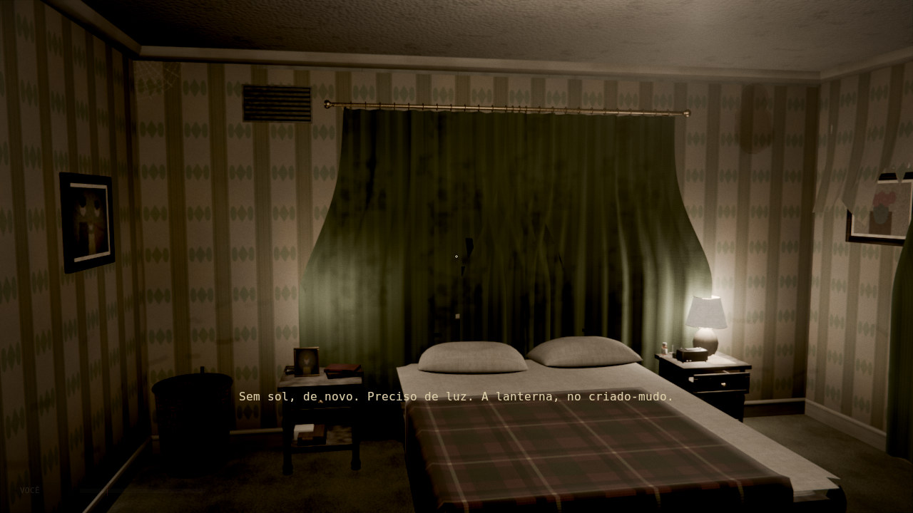
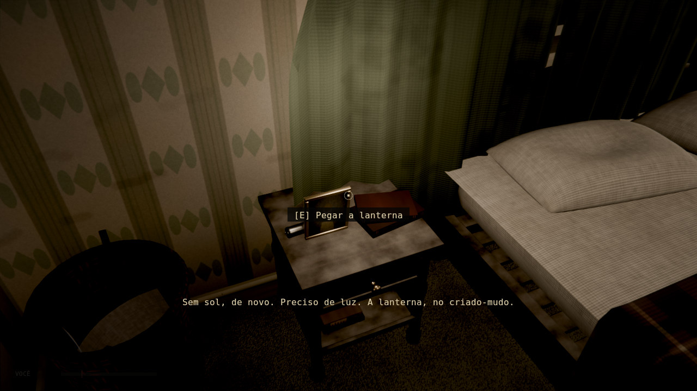
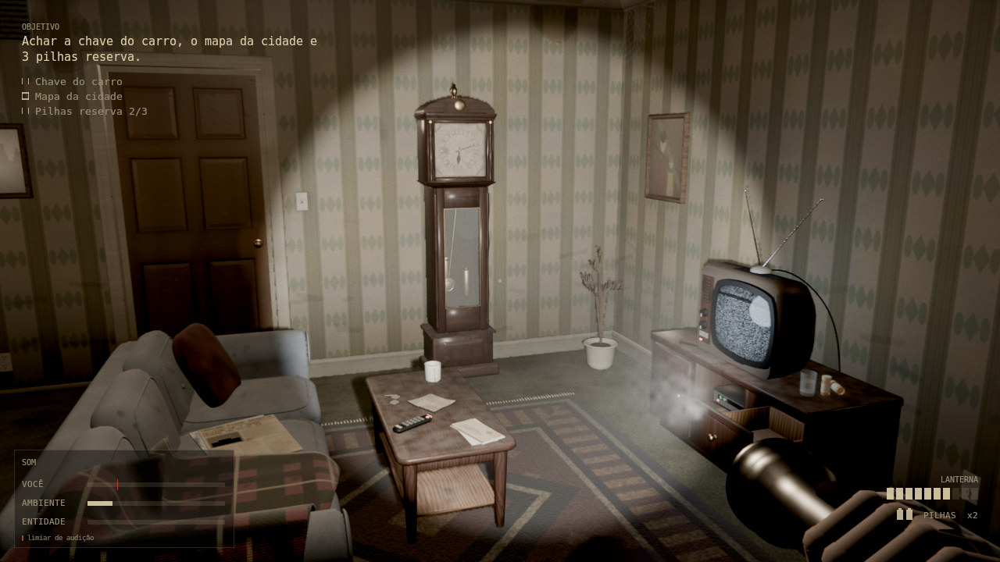
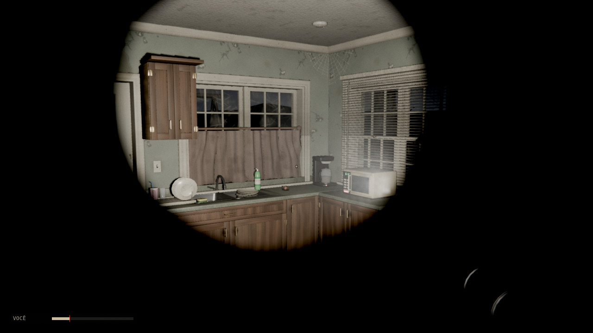
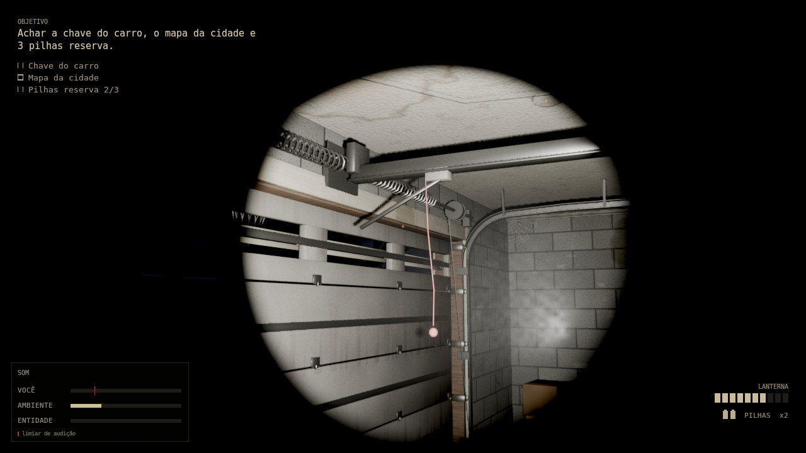

**Fase 3: corpo, HUD e inventário**

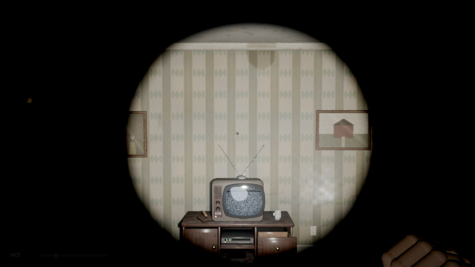
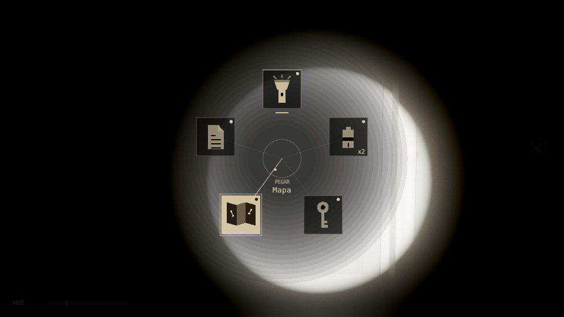
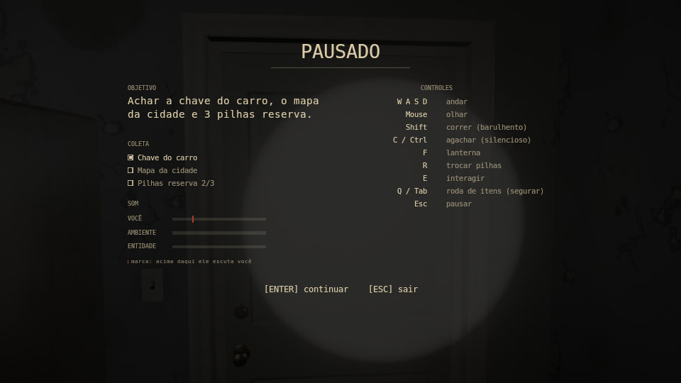
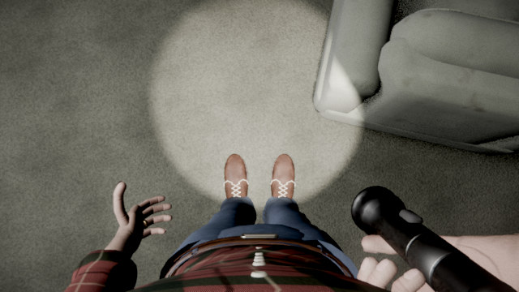
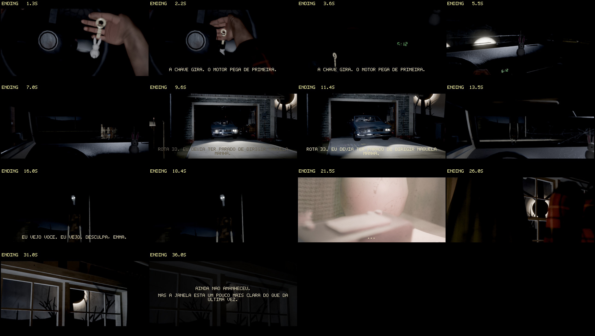

Mais em [`docs/capturas`](docs/capturas): os dois quartos de cima, banheiro, escada, escritório com o quadro de cortiça, hall, sala de jantar, o carro, o leitor de notas, a tela de título, as sequências dos gestos de cada item (`38` a `42`) e as folhas das cinco cutscenes (`50` a `54`). Os arquivos `estudio_*` mostram o exterior e o carro sob luz de apoio (veja os limites abaixo).

Essas imagens não são gravações da janela do Blender. As de dentro da casa foram geradas por `tools/prints.py`, que monta o jogo de verdade (`Game`), posiciona o jogador, renderiza a câmera dele no EEVEE e desenha o HUD por cima com o mesmo código de layout que o jogo usa na GPU. O visual ao vivo deve ser parecido, mas o desempenho e o compositor em tempo real só se confirmam abrindo o jogo.

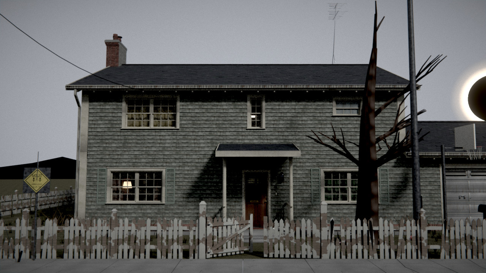
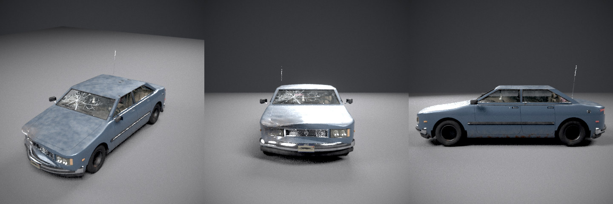

## Como jogar

Precisa do Blender 4.2 LTS ou mais novo (testado no 4.2.0 e no 5.0.1) e de uma GPU que rode EEVEE.

O `SemAlvorada.blend` incluído foi salvo pelo Blender 5.0.1. Se o seu for anterior ao 5.0, reconstrua o arquivo antes de jogar, com a sua versão: `blender -b --python construir.py` (leva alguns segundos).

```
./jogar.sh                         # Linux e macOS
jogar.bat                          # Windows
./jogar.sh --quality low           # se o jogo ficar pesado
./jogar.sh --skip-intro --debug    # pula a abertura; F1 a F4 viram atalhos de teste
```

Se o `blender` não estiver no PATH, aponte para ele: `BLENDER=/opt/blender-5.0/blender ./jogar.sh`. No Windows: `set BLENDER="C:\Program Files\Blender Foundation\Blender 5.0\blender.exe"`.

Alternativa sem linha de comando: abra `SemAlvorada.blend`, abra o texto `jogar.py` no editor de texto do Blender e rode com Alt+P.

| Tecla | Ação |
|---|---|
| W A S D | andar |
| Mouse | olhar |
| Shift | correr (barulhento) |
| C ou Ctrl | agachar (silencioso) |
| F | ligar e desligar a lanterna |
| R | trocar as pilhas da lanterna |
| E | interagir (pegar, abrir, ler, entrar no carro) |
| Q ou Tab (segurar) | roda de itens: mova o mouse na direção do setor e solte |
| Esc | pausar (objetivo, lista de coleta, medidor completo e controles); Esc de novo sai e devolve a interface do Blender |

**Roda de itens.** Cinco setores fixos, em sentido horário a partir do topo: lanterna, pilhas, chave, mapa e anotações. A lanterna fica sempre na mão direita; a roda escolhe o que vai na mão esquerda. Setor apagado é item que você ainda não tem. Soltar a tecla sem mover o mouse mantém o que já está na mão. O mundo não pausa e a câmera não gira enquanto a roda está aberta.

**Tela.** Em jogo só aparecem a mira (com a dica de interação quando há alvo), a barra de som, a bateria da lanterna por alguns segundos depois de usá-la (e sempre que está abaixo de 25%) e o fôlego quando está acabando. O personagem só fala ao começar a partida e ao pegar um item principal.

## O que importa no jogo: o som

O medidor no canto inferior esquerdo mostra, em jogo, a barra **VOCÊ** (quase transparente em silêncio) e a **ENTIDADE** enquanto dá para ouvi-la. No menu de pausa ele aparece completo, com as três barras:

- **VOCÊ**: o barulho que seu corpo faz agora.
- **AMBIENTE**: o ruído de fundo do cômodo, que te esconde.
- **ENTIDADE**: o quanto você ouve dela.

| O que você faz | Ruído |
|---|---|
| parado | 0,00 |
| agachado, andando | 0,08 |
| andando | 0,30 |
| correndo | 0,75 |
| porta que range | 0,55 |
| bater uma porta | 0,90 |

O piso muda o valor: carpete abafa (×0,55), azulejo ecoa (×1,15), a escada range (×1,35). O som não anda em linha reta: ele viaja pelos cômodos, perde força a cada metro, perde mais quando passa por porta fechada ou por outro andar, e é diminuído pelo ruído de fundo de onde a entidade está. Por isso a cozinha, com o zumbido da geladeira, é um bom esconderijo.

As portas abrem e fecham com aceleração e desaceleração (de 0,9 a 1,4 s), e a dobradiça pode ranger: mais se você está correndo e na primeira vez que uma porta velha é aberta, menos se você está agachado ou parado. O ranger se ouve a uns 9 m em linha livre (um cômodo e meio) e quase não passa por porta fechada. A tabela de chances está no topo de `sem_alvorada/engine/doors.py`.

A entidade segue regras que dá para aprender:

- Ela **ouve** o que passa do limiar (0,08 depois da propagação) e vai até a origem do som, com erro maior quanto mais fraco ele foi.
- Ela **vê** a lanterna acesa de longe (18 m) e quase nada no escuro (5,5 m). Agachado e parado reduzem isso. A percepção sobe aos poucos, não de uma vez.
- Quando você está perto e quieto, ela espreita: se aproxima devagar e **sem fazer som**. O zumbido grave dela some. Se ele parou, ela está perto.
- Ela é mais lenta que você correndo (4,1 contra 4,6 m/s), mas você se cansa antes.

## Estrutura do projeto

```
SemAlvorada.blend      o jogo construído (casa, props, entidade, cutscenes, navegação)
play.py                inicia a partida dentro do Blender
sem_alvorada/
  layout.py            planta da casa: fonte única de geometria, colisão, IA e som
  conventions.py       nomes, constantes, orçamentos de triângulos e as tabelas de ruído
  story.py             todo o texto do jogo (pt-BR)
  craft.py             acabamento das malhas: chanfro, subdivisão, pano, tubos, leitura de .npz
  world/               casa, texturas procedurais, luzes, rua, Sol Negro, pós-processamento
  props/               móveis, itens, notas, carro
  entity/              o Alto: modelo, esqueleto e animação procedural
  body/                corpo do jogador: modelo, armadura de 54 ossos, IK dos braços, dedos, locomoção
  cutscenes/           roteiro e player das cinco cenas, câmera em caminhos, atores e animação de objetos
  engine/              jogador, mãos e itens, inventário, lanterna, portas, HUD, operador modal
  audio/               síntese dos sons, reprodução 3D e sistema de ruído
  ai/                  cérebro da entidade e malha de navegação
assets/models/         malhas pré-calculadas (.npz) de peças que dependem de bibliotecas externas
tools/                 capturas (prints.py), inspeção de objeto e scripts de modelagem auxiliar
tools/movimento_ref/   mocap real (CMU), gravador do jogo, métricas, retarget, palco, vídeo lado a lado
docs/CONTRACT.md       contrato entre os módulos
docs/ACABAMENTO.md     padrão de modelagem da fase 2
docs/FASE3.md          contrato da fase 3: corpo, mãos, roda de itens, HUD, portas, cutscenes
docs/FASE4.md          fase 4: movimento verídico, referências reais e a divisão do trabalho
tests/                 testes (scripts com assert)
```

### Ferramentas auxiliares de modelagem

Algumas peças (a carroceria do carro, o tampo da pia com cuba) precisam de operações que o Blender faz mal, como interseção booleana robusta. Elas são modeladas offline em `tools/modelagem/` com `trimesh`, `manifold3d`, `shapely` e `scipy`, e o resultado vai para `assets/models/*.npz`. O jogo só lê o `.npz` com numpy: nenhum módulo de `sem_alvorada/` importa essas bibliotecas, então quem só quer jogar ou reconstruir o `.blend` não precisa instalar nada além do Blender. Só é preciso rodar o script de novo se a forma da peça mudar. Veja [`tools/modelagem/README.md`](tools/modelagem/README.md).

## Reconstruir e testar

O `.blend` é gerado por código. Para refazê-lo:

```
blender -b --python construir.py -- --quality medium     # com o Blender instalado (cerca de 100 s em CPU, arquivo de ~53 MB)
python construir.py                                      # com o módulo bpy (pip install bpy)
python -m sem_alvorada.build --stages world,props --out out/parcial.blend   # só algumas etapas
python -m sem_alvorada.audio.synth                       # regenera os 99 sons em assets/audio
python -m sem_alvorada.layout                            # valida a planta e escreve out/planta_andar*.png
```

Testes (rodam sem janela; sem GPU use `LIBGL_ALWAYS_SOFTWARE=1`):

```
python tests/test_integration_build.py     # constrói tudo e confere as costuras entre módulos
python tests/sim_playthrough.py --rebuild  # um robô joga: coleta tudo, destranca a garagem, chega ao final
python tests/test_world_geometry.py        # casca da casa: vãos, escadas, exterior, orçamentos
python tests/test_props_layout.py          # móveis e itens: posição, alcance, texturas, orçamentos
python tests/test_engine_core.py
python tests/test_body.py                # corpo: ossos, pesos, IK, passada, plano de corte, custo por quadro
python tests/test_hands.py               # gestos dos itens, eventos, continuidade, lanterna
python tests/test_inventory.py           # roda de itens
python tests/test_speech_rule.py         # o personagem só fala nos casos previstos
python tests/test_movimento_ref.py       # infraestrutura de comparação de movimento: métricas, gravador, câmeras
python tests/test_doors.py               # curva das portas, ranger e reação da entidade
python tests/test_cutscenes_fluency.py   # continuidade da câmera a 60 Hz nas cinco cenas
python tests/test_audio_noise.py
python tests/test_ai_brain.py
```

Capturas do jogo como o jogador veria: `LIBGL_ALWAYS_SOFTWARE=1 python tools/prints.py sala_sofa --out out/prints` (a lista de cenários está em `tools/prints.py`). Para olhar um objeto isolado, de vários ângulos: `tools/inspect_object.py`.

## Movimento de referência

A fase 4 julga o movimento do jogo contra pessoas reais (captura de movimento da CMU, que não restringe o uso) e contra a física dos objetos, sempre lado a lado e alinhado pela FASE do gesto. A infraestrutura está em `tools/movimento_ref/`:

```
LIBGL_ALWAYS_SOFTWARE=1 python -m tools.movimento_ref.comparar --lista                 # cenários registrados
LIBGL_ALWAYS_SOFTWARE=1 python -m tools.movimento_ref.comparar andar \
    --vistas frente,lado,topo,primeira --saida out/movimento/andar                     # vídeo, folha de contato, gráficos, tabela
LIBGL_ALWAYS_SOFTWARE=1 python -m tools.movimento_ref.comparar --folha-retarget 07_01  # confere o retarget do mocap no Daniel
python -m tools.movimento_ref.cmu                                                      # baixa os clipes de referência (19 MB)
python tests/test_movimento_ref.py                                                     # BVH, métricas, gravador, coesão entre câmeras
```

O mocap é aplicado ao próprio corpo do jogador (`retarget.py`), o jogo é gravado sem janela (`grava.py`), as duas figuras aparecem no mesmo quadro de cada câmera (`palco.py`) e as mesmas métricas (`metricas.py`) saem dos dois lados. Veja o guia no topo de `tools/movimento_ref/__init__.py` e `docs/FASE4.md`.

## Por que não é um jogo "nativo" do Blender

O Blender removeu o Game Engine na versão 2.80. Este jogo roda como um operador modal em Python que usa a viewport 3D com EEVEE como tela, o módulo `aud` do Blender para o áudio 3D e `BVHTree` para colisão. A lógica do jogo (jogador, IA, ruído) é separada da interface (mouse, HUD), e é essa separação que permite testar partidas inteiras sem abrir janela.

## Limites conhecidos

- No Blender 4.x o pós-processamento é mais simples: o compositor não tem os nós de coordenadas e de ruído, então a vinheta vira uma máscara desfocada e a granulação de filme não existe. O `Fast GI` do EEVEE também não existe nessa versão.
- Tudo que exige janela e placa de vídeo reais (desenho do HUD com `gpu`, captura do mouse, compositor ao vivo, 30 fps no EEVEE, áudio em dispositivo real) foi escrito contra a API do Blender 5.0.1 e testado por introspecção, mas não foi executado numa GUI.
- O timbre dos sons foi conferido por números e espectrogramas, não de ouvido.
- O equilíbrio da dificuldade foi pouco exercitado: o robô de teste não se esconde.
- A cena tem cerca de 1,0 milhão de triângulos (teto de 1,2 milhão no teste de integração) e 216 props. Em GPU de entrada isso pode pesar no EEVEE: use `--quality low` e, se for preciso, esconda o exterior, que só aparece pelas janelas e no final.
- O exterior é quase preto no jogo, de propósito. As imagens `docs/capturas/estudio_*` (fachada, garagem, porta, telhado) foram feitas com `tools/vista_estudio.py`, e a do carro com `tools/inspect_object.py`, ambas com luz de apoio: mostram o modelo, não o que o jogador vê.
- O Alto (a entidade) continua com o modelo da primeira fase. Ele destoa do resto, agora mais detalhado, e é o próximo item.
- Ficaram simplificados: o interior do forno e do freezer (as tampas não abrem), as portas do carro (só fresta e maçaneta, sem animação) e o desenho de ranhuras do pneu (sulcos em geometria, relevo fino só em textura).
- O corpo do Daniel não tem cabeça (o pescoço termina atrás da câmera) e as roupas são dobras assadas na malha, sem simulação de pano. As mãos ainda não têm o acabamento final: de perto, alguns presets de dedos parecem tubos. No escuro só aparece o que está no cone da lanterna; por isso materiais e mãos têm um brilho mínimo e há uma luz de 1,4 W junto às mãos quando seguram algo.
- Os gestos de pegar a lanterna (2,9 s) e o mapa (2,6 s) passam do 1 s planejado. O jogador anda e olha durante todo o gesto; só o E fica bloqueado. A mesa fica além do alcance do braço (0,6 m), então o item "vem" até a mão em 0,26 s.
- A passada usa a velocidade de caminhada do jogo (2,6 m/s), que para o passo de 1,15 m já é um trote: o pé desliza de 10 a 25% da velocidade do chão durante o apoio.
- Na maçaneta, só a lingueta se mexe: as maçanetas da casa são peças torneadas e girá-las não muda a imagem.
- Nas cutscenes, a profundidade de campo está ligada por padrão e pode ser desligada (`SA_CUTSCENE_DOF=0`); a lanterna não aparece na mão do Daniel dentro das cenas.
- Duas famílias de funções de ruído para textura (`props/tex_noise.py` e `props/tex_ruido.py`) cobrem coisas parecidas e podem ser unificadas.
