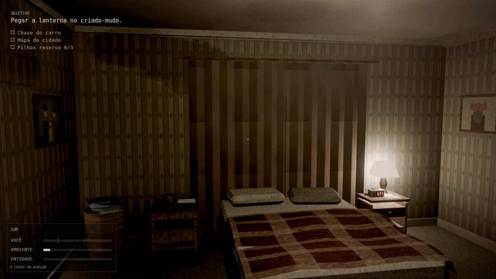
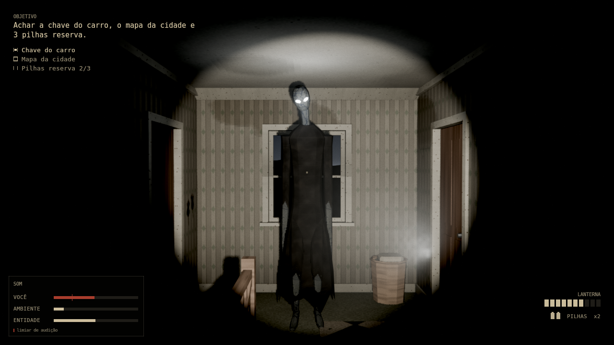
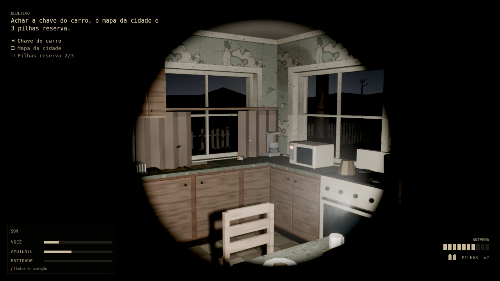
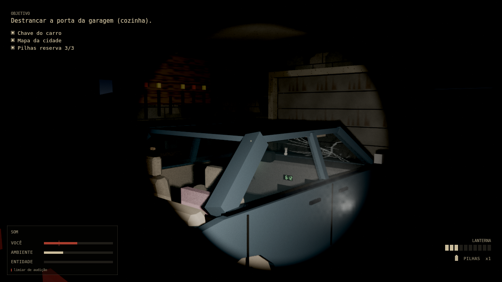

# SEM ALVORADA

Jogo de terror psicológico em primeira pessoa, feito inteiramente dentro do Blender. Modelos, texturas, sons e lógica são gerados por código Python: não há nenhum arquivo de arte, áudio ou modelo vindo de fora.

Domingo, 6:47, Harlan Ridge, Ohio. O sol devia ter nascido às 6:12 e a janela continua preta. Daniel acorda sozinho numa casa americana de dois andares e precisa de três coisas para sair dela: a **chave do carro**, o **mapa da cidade** e **três pilhas reserva** para a lanterna. Com tudo em mãos, a porta da garagem destranca. Enquanto isso, o Alto, uma figura de 2,65 m com olhos brancos, anda pela casa. Ele escuta melhor do que enxerga.

## Capturas






Mais em [`docs/capturas`](docs/capturas): escada, sala com a TV chiando, leitor de notas, tela de título e quadros das cutscenes de abertura, morte e final.

Essas imagens não são gravações da janela do Blender. Foram geradas por `tools/prints.py`, que monta o jogo de verdade (`Game`), posiciona o jogador, renderiza a câmera dele no EEVEE e desenha o HUD por cima com o mesmo código de layout que o jogo usa na GPU. O visual ao vivo deve ser parecido, mas o desempenho e o compositor em tempo real só se confirmam abrindo o jogo.

## Como jogar

Precisa do Blender 4.2 LTS ou mais novo (testado no 4.2.0 e no 5.0.1) e de uma GPU que rode EEVEE.

O `SemAlvorada.blend` incluído foi salvo pelo Blender 5.0.1. Se o seu for anterior ao 5.0, reconstrua o arquivo antes de jogar, com a sua versão: `blender -b --python construir.py` (leva alguns segundos).

```
./jogar.sh                         # Linux e macOS
jogar.bat                          # Windows
./jogar.sh --quality low           # se o jogo ficar pesado
./jogar.sh --skip-intro --debug    # pula a abertura; F1 a F4 viram atalhos de teste
```

Se o `blender` não estiver no PATH, aponte para ele: `BLENDER=/opt/blender-5.0/blender ./jogar.sh`. No Windows: `set BLENDER="C:\Program Files\Blender Foundation\Blender 5.0\blender.exe"`.

Alternativa sem linha de comando: abra `SemAlvorada.blend`, abra o texto `jogar.py` no editor de texto do Blender e rode com Alt+P.

| Tecla | Ação |
|---|---|
| W A S D | andar |
| Mouse | olhar |
| Shift | correr (barulhento) |
| C ou Ctrl | agachar (silencioso) |
| F | ligar e desligar a lanterna |
| R | trocar as pilhas da lanterna |
| E | interagir (pegar, abrir, ler, entrar no carro) |
| Esc | pausar; Esc de novo sai e devolve a interface do Blender |

## O que importa no jogo: o som

O medidor no canto inferior esquerdo mostra três barras:

- **VOCÊ**: o barulho que seu corpo faz agora.
- **AMBIENTE**: o ruído de fundo do cômodo, que te esconde.
- **ENTIDADE**: o quanto você ouve dela.

| O que você faz | Ruído |
|---|---|
| parado | 0,00 |
| agachado, andando | 0,08 |
| andando | 0,30 |
| correndo | 0,75 |
| bater uma porta | 0,90 |

O piso muda o valor: carpete abafa (×0,55), azulejo ecoa (×1,15), a escada range (×1,35). O som não anda em linha reta: ele viaja pelos cômodos, perde força a cada metro, perde mais quando passa por porta fechada ou por outro andar, e é diminuído pelo ruído de fundo de onde a entidade está. Por isso a cozinha, com o zumbido da geladeira, é um bom esconderijo.

A entidade segue regras que dá para aprender:

- Ela **ouve** o que passa do limiar (0,08 depois da propagação) e vai até a origem do som, com erro maior quanto mais fraco ele foi.
- Ela **vê** a lanterna acesa de longe (18 m) e quase nada no escuro (5,5 m). Agachado e parado reduzem isso. A percepção sobe aos poucos, não de uma vez.
- Quando você está perto e quieto, ela espreita: se aproxima devagar e **sem fazer som**. O zumbido grave dela some. Se ele parou, ela está perto.
- Ela é mais lenta que você correndo (4,1 contra 4,6 m/s), mas você se cansa antes.

## Estrutura do projeto

```
SemAlvorada.blend      o jogo construído (casa, props, entidade, cutscenes, navegação)
play.py                inicia a partida dentro do Blender
sem_alvorada/
  layout.py            planta da casa: fonte única de geometria, colisão, IA e som
  conventions.py       nomes, constantes e as tabelas de ruído
  story.py             todo o texto do jogo (pt-BR)
  world/               casa, texturas procedurais, luzes, rua, Sol Negro, pós-processamento
  props/               móveis, itens, notas, carro
  entity/              o Alto: modelo, esqueleto e animação procedural
  cutscenes/           roteiro e player das cinco cenas
  engine/              jogador, lanterna, portas, HUD, operador modal
  audio/               síntese dos sons, reprodução 3D e sistema de ruído
  ai/                  cérebro da entidade e malha de navegação
docs/CONTRACT.md       contrato entre os módulos
tests/                 testes (scripts com assert)
```

## Reconstruir e testar

O `.blend` é gerado por código. Para refazê-lo:

```
blender -b --python construir.py -- --quality medium     # com o Blender instalado
python construir.py                                      # com o módulo bpy (pip install bpy)
python -m sem_alvorada.build --stages world,props --out out/parcial.blend   # só algumas etapas
python -m sem_alvorada.audio.synth                       # regenera os 77 sons em assets/audio
python -m sem_alvorada.layout                            # valida a planta e escreve out/planta_andar*.png
```

Testes (rodam sem janela; sem GPU use `LIBGL_ALWAYS_SOFTWARE=1`):

```
python tests/test_integration_build.py     # constrói tudo e confere as costuras entre módulos
python tests/sim_playthrough.py --rebuild  # um robô joga: coleta tudo, destranca a garagem, chega ao final
python tests/test_engine_core.py
python tests/test_audio_noise.py
python tests/test_ai_brain.py
```

## Por que não é um jogo "nativo" do Blender

O Blender removeu o Game Engine na versão 2.80. Este jogo roda como um operador modal em Python que usa a viewport 3D com EEVEE como tela, o módulo `aud` do Blender para o áudio 3D e `BVHTree` para colisão. A lógica do jogo (jogador, IA, ruído) é separada da interface (mouse, HUD), e é essa separação que permite testar partidas inteiras sem abrir janela.

## Limites conhecidos

- No Blender 4.x o pós-processamento é mais simples: o compositor não tem os nós de coordenadas e de ruído, então a vinheta vira uma máscara desfocada e a granulação de filme não existe. O `Fast GI` do EEVEE também não existe nessa versão.
- Tudo que exige janela e placa de vídeo reais (desenho do HUD com `gpu`, captura do mouse, compositor ao vivo, 30 fps no EEVEE, áudio em dispositivo real) foi escrito contra a API do Blender 5.0.1 e testado por introspecção, mas não foi executado numa GUI.
- O timbre dos sons foi conferido por números e espectrogramas, não de ouvido.
- O equilíbrio da dificuldade foi pouco exercitado: o robô de teste não se esconde.
